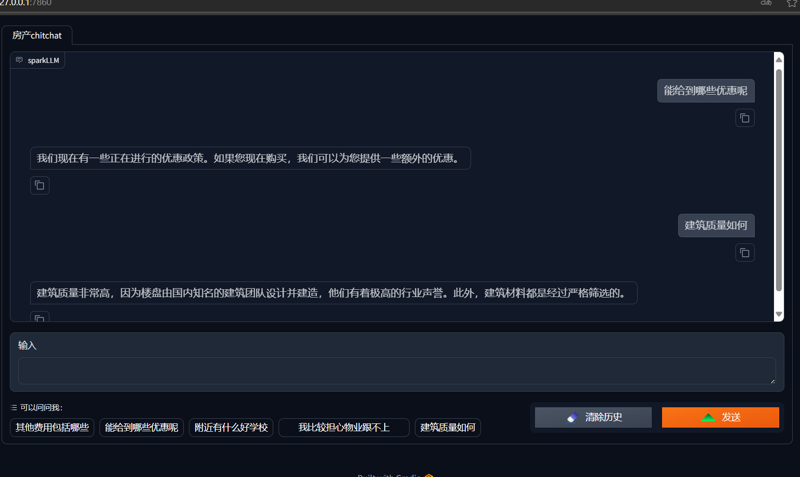

## a simple demo about RAG using iFlyTek's Spark large language model.(real estate Q&A)

一个使用了科大讯飞大模型接口的检索增强小demo（房地产Q&A问答版）

easy to run via docker

----
### 启动方式
1. configs/config.py中填入科大讯飞接口的鉴权信息，https://www.xfyun.cn/doc/spark/Web.html
```py
SPARK_ID = 'xxxxxxxx'
SPARK_SECRET = 'xxxxxxxxxxxxxxxxxxxxxxxxxxxxxxxx'
SPARK_KEY = 'xxxxxxxxxxxxxxxxxxxxxxxxxxxxxxxx'
```

2. 项目根目录下启动docker 注意最后有个英文句点 be ware of the period
```bash
docker build -t aname:v1 .
```

3. 启动
```bash
docker run -dp 7860:7860 --name acontainer aname:v1
```

### 演示


----
### REFs

#### 七种RAG架构模式汇总


https://x.com/shao__meng/status/1866626166079230355

https://x.com/weaviate_io/status/1866528335884325070

#### 还有好多 #TODO，缓慢更新中。to be continued...

1. ~~Q&A文本~~

2. 持续更新多个LLM接口

3. 连续非结构化文本格式（PDF, txt, docx类的长文本：规章制度，文档条款等等）

4. 对话消息持久化

5. 检索来源显示

6. 上下文关联对话

7. 多种工具（选项卡切换）
   
8. 多种工具对话内自动切换

9. 多模态